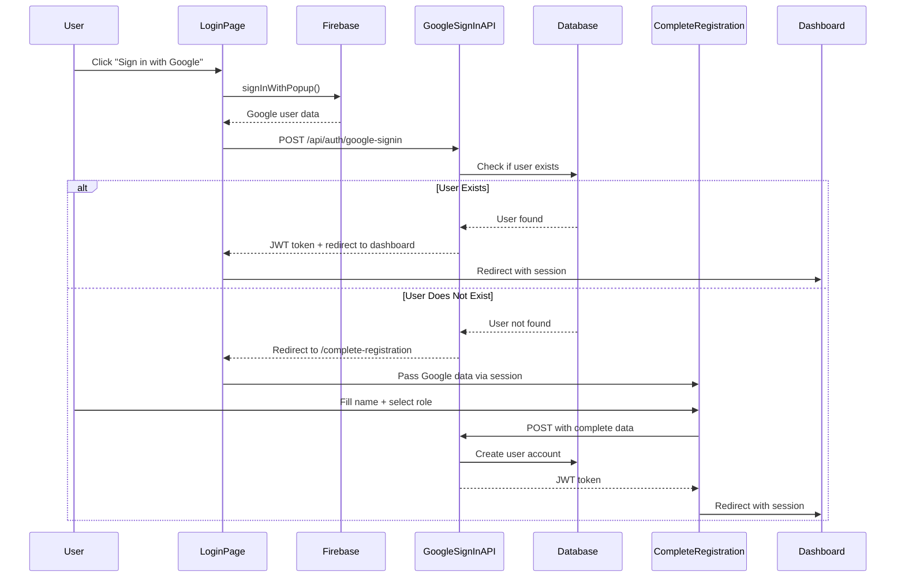

# Design Document

## Overview

This design implements a secure Google OAuth flow that prevents automatic account creation and requires new users to complete a simplified registration process. The solution modifies the existing OAuth implementation to check for existing accounts before granting access, and introduces a new registration completion page for first-time Google users.

### Key Design Principles

1. **Security First**: No automatic account creation without explicit user consent
2. **Minimal Friction**: Leverage Google-verified data to reduce registration steps
3. **Consistent Experience**: Maintain the existing UI/UX patterns from the current auth pages
4. **Backward Compatibility**: Existing Google OAuth users continue to work seamlessly

## Architecture

### High-Level Flow



## Components and Interfaces

### 1. Modified Google Sign-In API Route

**File**: `src/app/api/auth/google-signin/route.js`

**Current Behavior**: Automatically creates user accounts for new Google users

**New Behavior**: 
- Check if user exists in database
- If exists: Generate JWT and return success
- If not exists: Return a special response indicating registration needed

**API Response Structure**:

```javascript
// Existing User Response
{
  success: true,
  requiresRegistration: false,
  token: "jwt_token_here",
  user: {
    id: "user_id",
    name: "John Doe",
    email: "john@example.com",
    role: "student",
    photoURL: "https://..."
  }
}

// New User Response
{
  success: true,
  requiresRegistration: true,
  tempData: {
    email: "newuser@example.com",
    googleId: "google_uid",
    photoURL: "https://...",
    displayName: "John Doe"
  }
}
```

### 2. Modified Login Page

**File**: `src/app/(auth)/login/page.js`

**Changes to `handleGoogleSignIn` function**:
- Check response for `requiresRegistration` flag
- If true: Store temp data in sessionStorage and redirect to `/complete-registration`
- If false: Proceed with normal login flow

**Implementation**:

```javascript
const handleGoogleSignIn = async () => {
  setError('');
  setIsLoading(true);
  const provider = new GoogleAuthProvider();

  try {
    const result = await signInWithPopup(auth, provider);
    const user = result.user;

    const res = await fetch('/api/auth/google-signin', {
      method: 'POST',
      headers: { 'Content-Type': 'application/json' },
      body: JSON.stringify({
        firebaseUser: {
          uid: user.uid,
          email: user.email,
          displayName: user.displayName,
          photoURL: user.photoURL,
        }
      }),
    });

    const data = await res.json();

    if (res.ok) {
      if (data.requiresRegistration) {
        // Store temp data and redirect to registration completion
        sessionStorage.setItem('googleTempData', JSON.stringify(data.tempData));
        router.push('/complete-registration');
      } else {
        // Normal login flow
        if (data.token) {
          localStorage.setItem('token', data.token);
        }
        router.push('/home');
      }
    } else {
      setError(data.message || 'Failed to complete Google sign-in');
    }
  } catch (error) {
    console.error('Google Sign-In error:', error);
    setError('Failed to sign in with Google. Please try again.');
  } finally {
    setIsLoading(false);
  }
};
```

### 3. New Complete Registration Page

**File**: `src/app/(auth)/complete-registration/page.js`

**Purpose**: Collect additional required information from new Google OAuth users

**UI Components**:
- Pre-filled, read-only email field (from Google)
- Name input fields (first name, last name, optional middle name)
- Role selection dropdown (student, instructor, admin)
- Profile picture preview (from Google)
- Submit button
- Cancel button (returns to login)

**Form Fields**:

| Field | Type | Required | Source | Editable |
|-------|------|----------|--------|----------|
| Email | text | Yes | Google | No (read-only) |
| Profile Picture | image | No | Google | No (display only) |
| First Name | text | Yes | User input | Yes |
| Middle Name | text | No | User input | Yes |
| Last Name | text | Yes | User input | Yes |
| Suffix | text | No | User input | Yes |
| Role | select | Yes | User input | Yes |

**Validation Rules**:
- First name: Required, 2-50 characters
- Last name: Required, 2-50 characters
- Middle name: Optional, max 50 characters
- Suffix: Optional, max 10 characters
- Role: Required, must be one of: 'student', 'instructor', 'admin'

**Page Structure** (following existing auth page patterns):

```jsx
export default function CompleteRegistrationPage() {
  const [formData, setFormData] = useState({
    name: '',
    middleName: '',
    surname: '',
    suffix: '',
    role: 'student'
  });
  const [googleData, setGoogleData] = useState(null);
  const [error, setError] = useState('');
  const [isLoading, setIsLoading] = useState(false);
  const router = useRouter();

  useEffect(() => {
    // Load Google temp data from sessionStorage
    const tempData = sessionStorage.getItem('googleTempData');
    if (!tempData) {
      router.push('/login');
      return;
    }
    setGoogleData(JSON.parse(tempData));
    
    // Pre-fill name if available from Google
    const parsed = JSON.parse(tempData);
    if (parsed.displayName) {
      const parts = parsed.displayName.split(' ');
      setFormData(prev => ({
        ...prev,
        name: parts[0] || '',
        surname: parts[parts.length - 1] || ''
      }));
    }
  }, [router]);

  const handleSubmit = async (e) => {
    e.preventDefault();
    // Submit to new API endpoint
  };

  return (
    // UI similar to register page with neural network background
  );
}
```

### 4. New Complete Registration API Route

**File**: `src/app/api/auth/complete-google-registration/route.js`

**Purpose**: Create user account with Google data + user-provided information

**Request Body**:
```javascript
{
  googleData: {
    email: "user@example.com",
    googleId: "google_uid",
    photoURL: "https://...",
  },
  userData: {
    name: "John",
    middleName: "",
    surname: "Doe",
    suffix: "",
    role: "student"
  }
}
```

**Process**:
1. Validate all required fields
2. Verify email doesn't already exist (race condition check)
3. Create user document with:
   - Google-provided data (email, googleId, photoURL)
   - User-provided data (name, surname, role, etc.)
   - Set `isVerified: true` (Google verified)
   - Set `authProvider: 'google'`
   - Set `password: 'google_auth'` (placeholder)
4. Generate JWT token
5. Set httpOnly cookie
6. Return success response with token

**Response**:
```javascript
{
  success: true,
  message: "Registration completed successfully",
  token: "jwt_token",
  user: {
    id: "user_id",
    name: "John Doe",
    email: "user@example.com",
    role: "student",
    photoURL: "https://..."
  }
}
```

## Data Models

### User Model Updates

No schema changes required. The existing User model already supports all necessary fields:

```javascript
{
  name: String (required),
  middleName: String (optional),
  surname: String (required),
  suffix: String (optional),
  email: String (required, unique),
  password: String (required) // 'google_auth' for OAuth users,
  isVerified: Boolean (default: false) // true for Google users,
  googleId: String (optional),
  photoURL: String (optional),
  authProvider: String (enum: ['email', 'google']),
  role: String (enum: ['super admin', 'admin', 'instructor', 'student']),
  // ... other fields
}
```

### Session Storage Data Structure

**Key**: `googleTempData`

**Value** (JSON string):
```javascript
{
  email: "user@example.com",
  googleId: "google_uid_123",
  photoURL: "https://lh3.googleusercontent.com/...",
  displayName: "John Doe"
}
```

**Lifecycle**: 
- Created: When Google OAuth returns new user
- Used: On complete-registration page load
- Cleared: After successful registration or on cancel

## Error Handling

### Error Scenarios and Responses

| Scenario | HTTP Status | Error Message | User Action |
|----------|-------------|---------------|-------------|
| Google auth fails | 401 | "Failed to authenticate with Google" | Retry login |
| Network error during OAuth | 500 | "Connection error. Please try again." | Retry |
| User abandons registration | N/A | No error | Can retry later |
| Email already exists (race condition) | 409 | "An account with this email already exists" | Try logging in |
| Invalid role selection | 400 | "Please select a valid role" | Fix and resubmit |
| Missing required fields | 400 | "Please fill in all required fields" | Complete form |
| Session expired (no temp data) | N/A | Redirect to login | Start over |
| Database connection error | 500 | "Service temporarily unavailable" | Retry later |

### Error Handling Implementation

**Client-Side**:
```javascript
try {
  // API call
} catch (error) {
  if (error.response?.status === 409) {
    setError('This email is already registered. Please try logging in instead.');
    setTimeout(() => router.push('/login'), 3000);
  } else if (error.response?.status === 400) {
    setError(error.response.data.message);
  } else {
    setError('An unexpected error occurred. Please try again.');
  }
}
```

**Server-Side**:
```javascript
// In API routes
try {
  // Logic
} catch (error) {
  console.error('Error:', error);
  
  if (error.code === 11000) { // MongoDB duplicate key
    return NextResponse.json(
      { message: 'An account with this email already exists' },
      { status: 409 }
    );
  }
  
  return NextResponse.json(
    { message: 'Internal server error' },
    { status: 500 }
  );
}
```

## Testing Strategy

### Unit Tests

**Test File**: `__tests__/api/auth/google-signin.test.js`

Test cases:
1. Existing user login returns JWT token
2. New user returns requiresRegistration flag
3. Invalid Google data returns error
4. Database connection error handled gracefully

**Test File**: `__tests__/api/auth/complete-google-registration.test.js`

Test cases:
1. Valid registration creates user and returns token
2. Missing required fields returns 400 error
3. Duplicate email returns 409 error
4. Invalid role returns 400 error

### Integration Tests

**Test File**: `__tests__/integration/google-oauth-flow.test.js`

Test scenarios:
1. Complete flow: New user → OAuth → Registration → Dashboard
2. Complete flow: Existing user → OAuth → Dashboard
3. Abandoned registration: User can retry later
4. Race condition: Two tabs attempting registration simultaneously

### Manual Testing Checklist

- [ ] New Google user completes registration successfully
- [ ] Existing Google user logs in directly
- [ ] Email is pre-filled and read-only on registration page
- [ ] Name fields are pre-populated from Google displayName
- [ ] Role selection works correctly
- [ ] Cancel button returns to login page
- [ ] Session data is cleared after successful registration
- [ ] Error messages display correctly
- [ ] Loading states work properly
- [ ] Redirect flows work as expected
- [ ] JWT token is set correctly in cookies
- [ ] User can access dashboard after registration
- [ ] Profile picture from Google displays correctly

## Security Considerations

### 1. Session Data Protection

- Use `sessionStorage` (not `localStorage`) for temporary Google data
- Clear session data immediately after use
- Validate session data on server-side before account creation

### 2. CSRF Protection

- Verify Firebase token on server-side
- Use httpOnly cookies for JWT tokens
- Implement CSRF tokens for form submissions

### 3. Input Validation

- Sanitize all user inputs on server-side
- Validate email format matches Google-provided email
- Enforce role enum constraints
- Limit string lengths to prevent buffer overflow

### 4. Race Condition Prevention

- Check for existing email before account creation
- Use database unique constraints
- Handle duplicate key errors gracefully

### 5. Token Security

- JWT tokens expire after 7 days
- Include user role in JWT payload
- Verify token signature on protected routes
- Use secure, httpOnly cookies in production

## UI/UX Design

### Complete Registration Page Design

**Layout**: Follows existing auth page patterns with neural network background

**Color Scheme**:
- Background: Black with blue/purple gradient overlay
- Primary: Blue-to-purple gradient
- Text: White with varying opacity
- Inputs: White/10 background with white/20 border
- Buttons: Gradient blue-to-purple

**Components**:

1. **Header Section**
   - Title: "Complete Your Profile"
   - Subtitle: "Just a few more details to get started"

2. **Profile Preview**
   - Google profile picture (circular, 80px)
   - Email address (read-only, with lock icon)
   - "Verified by Google" badge

3. **Form Section**
   - Name fields (grid layout, 2 columns on desktop)
   - Role selection (dropdown with icons)
   - All fields have hover effects matching existing design

4. **Action Buttons**
   - Primary: "Complete Registration" (gradient button)
   - Secondary: "Cancel" (outlined button)

5. **Loading States**
   - Spinner animation during submission
   - Disabled state for buttons
   - "Creating your account..." message

### Responsive Design

- **Desktop** (≥768px): Two-column grid for name fields
- **Mobile** (<768px): Single column layout
- **Tablet**: Adaptive spacing and font sizes

### Accessibility

- Proper ARIA labels for all form fields
- Keyboard navigation support
- Focus indicators on interactive elements
- Screen reader announcements for errors
- High contrast text for readability

## Migration Strategy

### Phase 1: API Updates (No Breaking Changes)

1. Modify `/api/auth/google-signin` to check for existing users
2. Add new response format with `requiresRegistration` flag
3. Maintain backward compatibility (existing users unaffected)

### Phase 2: Frontend Updates

1. Create `/complete-registration` page
2. Update login page `handleGoogleSignIn` function
3. Add session storage management

### Phase 3: New API Endpoint

1. Create `/api/auth/complete-google-registration` route
2. Implement validation and user creation logic

### Phase 4: Testing & Deployment

1. Test with new Google accounts
2. Test with existing Google accounts
3. Test error scenarios
4. Deploy to production

### Rollback Plan

If issues arise:
1. Revert `/api/auth/google-signin` to auto-create users
2. Remove registration completion page
3. Clear any pending session data
4. Existing users continue working normally

## Performance Considerations

### Database Queries

- Single query to check user existence: `User.findOne({ email })`
- Indexed email field ensures fast lookups
- No additional database load for existing users

### Client-Side Performance

- Session storage operations are synchronous and fast
- No additional network requests for existing users
- New users: +1 page load, +1 API call (acceptable trade-off for security)

### Caching Strategy

- No caching needed for OAuth flow (security-sensitive)
- JWT tokens cached in httpOnly cookies
- Profile pictures cached by browser (Google CDN)

## Monitoring and Logging

### Metrics to Track

1. **OAuth Success Rate**: Percentage of successful Google authentications
2. **Registration Completion Rate**: Percentage of users who complete registration after OAuth
3. **Registration Abandonment**: Users who start but don't finish registration
4. **Error Rates**: Track specific error types and frequencies
5. **Time to Complete**: Average time from OAuth to registration completion

### Logging Strategy

**Client-Side** (console logs):
```javascript
console.log('✅ Google OAuth successful');
console.log('🔄 Redirecting to registration completion');
console.log('✅ Registration completed');
```

**Server-Side** (structured logs):
```javascript
console.log('Google OAuth - New user detected:', { email, googleId });
console.log('Registration completed:', { userId, email, role });
console.error('Registration failed:', { email, error: error.message });
```

### Alert Conditions

- OAuth error rate > 5%
- Registration completion rate < 70%
- Database connection failures
- Duplicate email errors (potential race conditions)

## Future Enhancements

### Phase 2 Features (Post-MVP)

1. **Social Profile Import**: Import additional data from Google (birthday, location)
2. **Profile Picture Upload**: Allow users to change Google profile picture
3. **Email Preferences**: Set notification preferences during registration
4. **Welcome Email**: Send personalized welcome email after registration
5. **Onboarding Flow**: Guide new users through platform features
6. **Analytics Integration**: Track user journey through registration funnel

### Potential Improvements

1. **Multi-Provider Support**: Extend to Facebook, GitHub, Microsoft OAuth
2. **Progressive Registration**: Collect additional info over time
3. **Smart Role Detection**: Suggest role based on email domain
4. **Duplicate Account Detection**: Warn if similar account exists
5. **Registration Recovery**: Allow users to resume abandoned registrations
