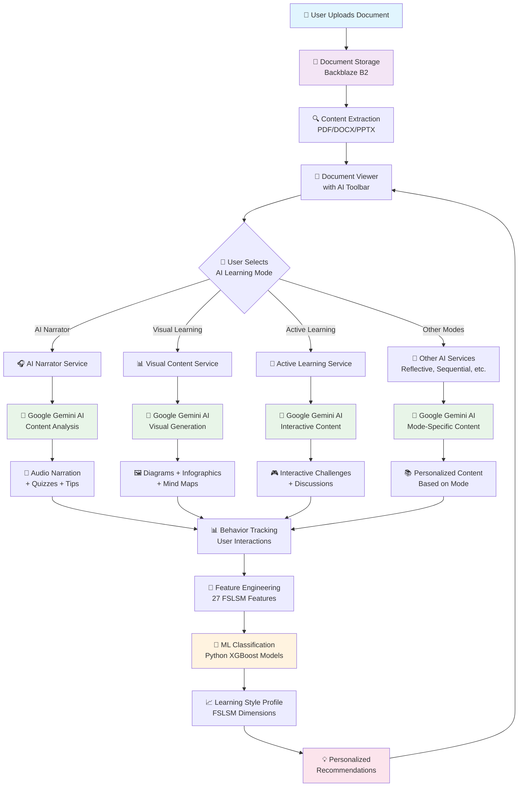
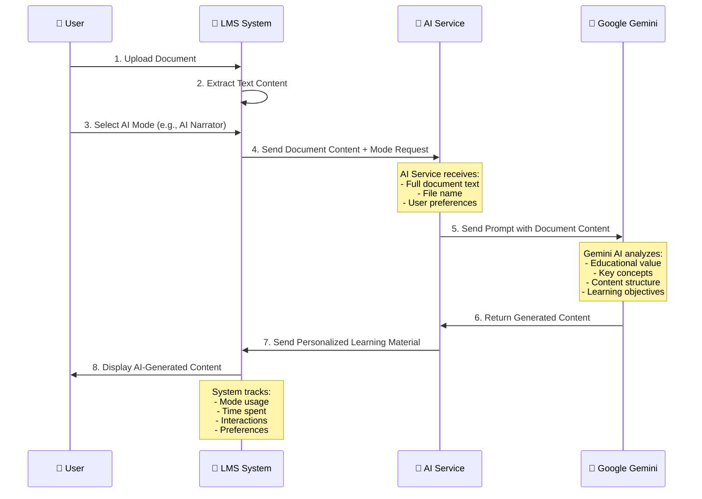
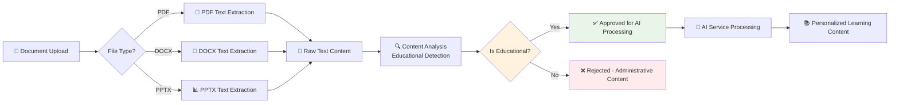
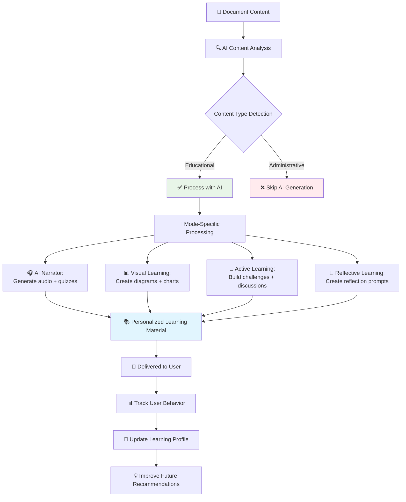

# LMS to AI Generative Process Flow

## Simple Flow Diagram

```mermaid
flowchart TD
    A[👤 User Uploads Document] --> B[📄 Document Storage<br/>Backblaze B2]
    B --> C[🔍 Content Extraction<br/>PDF/DOCX/PPTX]
    C --> D[📖 Document Viewer<br/>with AI Toolbar]
    
    D --> E{🎯 User Selects<br/>AI Learning Mode}
    
    E -->|AI Narrator| F1[🎧 AI Narrator Service]
    E -->|Visual Learning| F2[📊 Visual Content Service]
    E -->|Active Learning| F3[🎯 Active Learning Service]
    E -->|Other Modes| F4[🔮 Other AI Services<br/>Reflective, Sequential, etc.]
    
    F1 --> G1[🤖 Google Gemini AI<br/>Content Analysis]
    F2 --> G2[🤖 Google Gemini AI<br/>Visual Generation]
    F3 --> G3[🤖 Google Gemini AI<br/>Interactive Content]
    F4 --> G4[🤖 Google Gemini AI<br/>Mode-Specific Content]
    
    G1 --> H1[🎵 Audio Narration<br/>+ Quizzes + Tips]
    G2 --> H2[🖼️ Diagrams + Infographics<br/>+ Mind Maps]
    G3 --> H3[🎮 Interactive Challenges<br/>+ Discussions]
    G4 --> H4[📚 Personalized Content<br/>Based on Mode]
    
    H1 --> I[📊 Behavior Tracking<br/>User Interactions]
    H2 --> I
    H3 --> I
    H4 --> I
    
    I --> J[🧠 Feature Engineering<br/>27 FSLSM Features]
    J --> K[🤖 ML Classification<br/>Python XGBoost Models]
    K --> L[📈 Learning Style Profile<br/>FSLSM Dimensions]
    L --> M[💡 Personalized<br/>Recommendations]
    
    M --> D
    
    style A fill:#e1f5fe
    style B fill:#f3e5f5
    style G1 fill:#e8f5e8
    style G2 fill:#e8f5e8
    style G3 fill:#e8f5e8
    style G4 fill:#e8f5e8
    style K fill:#fff3e0
    style M fill:#fce4ec
```

## How AI Knows About the Document

```mermaid
sequenceDiagram
    participant U as 👤 User
    participant LMS as 🏫 LMS System
    participant AI as 🤖 AI Service
    participant Gemini as 🧠 Google Gemini
    
    U->>LMS: 1. Upload Document
    LMS->>LMS: 2. Extract Text Content
    U->>LMS: 3. Select AI Mode (e.g., AI Narrator)
    LMS->>AI: 4. Send Document Content + Mode Request
    
    Note over AI: AI Service receives:<br/>- Full document text<br/>- File name<br/>- User preferences
    
    AI->>Gemini: 5. Send Prompt with Document Content
    
    Note over Gemini: Gemini AI analyzes:<br/>- Educational value<br/>- Key concepts<br/>- Content structure<br/>- Learning objectives
    
    Gemini->>AI: 6. Return Generated Content
    AI->>LMS: 7. Send Personalized Learning Material
    LMS->>U: 8. Display AI-Generated Content
    
    Note over LMS: System tracks:<br/>- Mode usage<br/>- Time spent<br/>- Interactions<br/>- Preferences
```

## Document Processing Detail

```mermaid
graph LR
    A[📄 Document Upload] --> B{File Type?}
    
    B -->|PDF| C1[📄 PDF Text Extraction]
    B -->|DOCX| C2[📝 DOCX Text Extraction]
    B -->|PPTX| C3[📊 PPTX Text Extraction]
    
    C1 --> D[📝 Raw Text Content]
    C2 --> D
    C3 --> D
    
    D --> E[🔍 Content Analysis<br/>Educational Detection]
    
    E --> F{Is Educational?}
    F -->|Yes| G[✅ Approved for AI Processing]
    F -->|No| H[❌ Rejected - Administrative Content]
    
    G --> I[🤖 AI Service Processing]
    I --> J[📚 Personalized Learning Content]
    
    style F fill:#fff3e0
    style G fill:#e8f5e8
    style H fill:#ffebee
```

## AI Content Generation Process

```mermaid
flowchart TD
    A[📄 Document Content] --> B[🔍 AI Content Analysis]
    
    B --> C{Content Type Detection}
    C -->|Educational| D[✅ Process with AI]
    C -->|Administrative| E[❌ Skip AI Generation]
    
    D --> F[🎯 Mode-Specific Processing]
    
    F --> G1[🎧 AI Narrator:<br/>Generate audio + quizzes]
    F --> G2[📊 Visual Learning:<br/>Create diagrams + charts]
    F --> G3[🎯 Active Learning:<br/>Build challenges + discussions]
    F --> G4[🤔 Reflective Learning:<br/>Create reflection prompts]
    
    G1 --> H[📚 Personalized Learning Material]
    G2 --> H
    G3 --> H
    G4 --> H
    
    H --> I[👤 Delivered to User]
    I --> J[📊 Track User Behavior]
    J --> K[🧠 Update Learning Profile]
    K --> L[💡 Improve Future Recommendations]
    
    style D fill:#e8f5e8
    style E fill:#ffebee
    style H fill:#e1f5fe
```