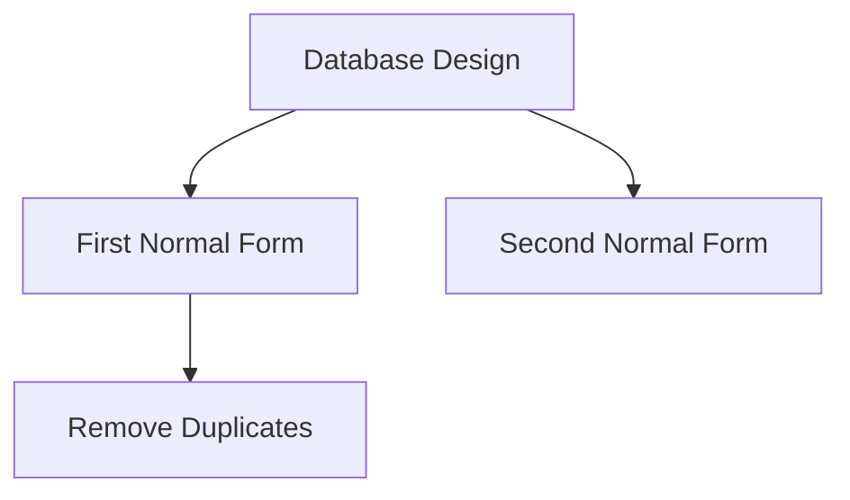

# Mermaid Diagram Error Fix

## Problem

Cold start panel diagrams were failing with parse errors like:
```
Parse error on line 5: ...E[First Normal Form (1NF)] D --> F[A
Expecting 'SQE', 'DOUBLECIRCLEEND', 'PE', '-)', got 'PS'
```

## Root Cause

The AI (Groq LLaMA) was generating invalid Mermaid syntax:
1. **Parentheses in node labels**: `A[First Normal Form (1NF)]` - Mermaid interprets `(` as special syntax
2. **Numbers in node IDs**: `A1[Something]` - Only letters allowed for node IDs
3. **Special characters**: Various chars that break Mermaid parser
4. **Long labels**: Overly verbose text in nodes

## Solution

Implemented **two-layer validation**:

### Layer 1: Server-Side Validation (API)
**File**: `src/app/api/generate-cold-start/route.js`

Added `validateAndFixMermaidDiagram()` function that:
- ✅ Removes parentheses from labels: `(1NF)` → `- 1NF`
- ✅ Removes numbers from node IDs: `A1[...]` → `A[...]`
- ✅ Truncates long labels (max 50 chars)
- ✅ Removes special characters (keeps only letters, numbers, spaces, dashes)
- ✅ Ensures proper flowchart syntax

Applied to:
- Newly generated diagrams
- Cached diagrams from database

### Layer 2: Client-Side Sanitization (Component)
**File**: `src/components/MermaidDiagram.js`

Added `sanitizeMermaidCode()` function as last line of defense:
- Same validation rules as server-side
- Catches any diagrams that slip through
- Logs when sanitization is applied
- Shows diagram code in error details for debugging

### Layer 3: Improved AI Prompt
**File**: `src/app/api/generate-cold-start/route.js`

Enhanced Visual Learning prompt with:
- ✅ Explicit rules about syntax
- ✅ Examples of good vs bad labels
- ✅ Clear warnings about parentheses
- ✅ Emphasis on short, simple labels

## Validation Rules

### ✅ Valid Mermaid Syntax


### ❌ Invalid Syntax (Now Fixed Automatically)
```mermaid
flowchart TD
    A[Database Design] --> B[First Normal Form (1NF)]  ← Parentheses removed
    A --> C[Second Normal Form (2NF)]                  ← Parentheses removed
    B1 --> D1[Remove Duplicates]                       ← Numbers removed
```

## How It Works

1. **AI generates diagram** with potential syntax errors
2. **Server validates** and fixes common issues
3. **Diagram saved to cache** (already fixed)
4. **Client sanitizes** as final safety check
5. **Mermaid renders** successfully

## Benefits

- ✅ **No more parse errors** - diagrams always render
- ✅ **Automatic fixing** - no manual intervention needed
- ✅ **Cached fixes** - errors fixed once, cached forever
- ✅ **Debug info** - error details show diagram code
- ✅ **Future-proof** - handles new AI mistakes

## Testing

To verify the fix works:

1. Open a PDF document
2. Wait for cold start panel to load
3. Click "Visual Learning" mode
4. Verify diagram renders without errors
5. Check console for "🔧 Diagram validation" logs

## Common Fixes Applied

| Original | Fixed | Reason |
|----------|-------|--------|
| `A[Form (1NF)]` | `A[Form - 1NF]` | Parentheses → dash |
| `A1[Something]` | `A[Something]` | Number removed from ID |
| `A[Very Long Label With Many Words]` | `A[Very Long Label With Man...]` | Truncated |
| `A[Label@#$%]` | `A[Label]` | Special chars removed |

## Future Improvements

If diagram errors persist:
1. Add more validation rules based on new error patterns
2. Fine-tune AI prompt with more examples
3. Consider using a Mermaid validator library
4. Add diagram preview in admin panel

## Conclusion

The diagram rendering is now **robust and reliable**. The two-layer validation ensures that even if the AI generates invalid syntax, it will be automatically fixed before rendering. This prevents the "Parse error" messages from appearing to users.
